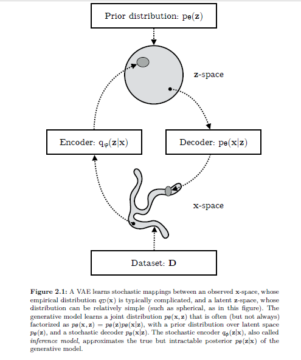

# Variational autoencoders

## Definition
For variational auto-encoders, instead of a deterministic mapping to the latent representation, we model a probability distribution of the latent variable. See figure below from 
[Kingma and Welling 2019](https://arxiv.org/abs/1906.02691)

## ELBO
We wish to maximise the marginal likelihood of x given by the model. However, this is intractable (as requires integration over the latent variables). 
Instead we maximise the evidence lower bound, which can be derived by:


$$
\begin{aligned}
\log p_{\theta}(\mathrm{x})=& \mathbb{E_{q_{\phi}(\mathbf{z} \mid \mathbf{x})}}\left[\log p_{\theta}(\mathrm{x})\right] \\
=& \mathbb{E_{q_{\phi}(\mathbf{z} \mid \mathbf{x})}}\left[\log \left[\frac{p_{\theta}(\mathbf{x}, \mathbf{z})}{p_{\theta}(\mathbf{z} \mid \mathbf{x})}\right]\right] \\
=& \mathbb{E_{q_{\phi}(\mathbf{z} \mid \mathbf{x})}}\left[\log \left[\frac{p_{\theta}(\mathbf{x}, \mathbf{z})}{q_{\phi}(\mathbf{z} \mid \mathbf{x})} \frac{q_{\phi}(\mathbf{z} \mid \mathbf{x})}{p_{\theta}(\mathbf{z} \mid \mathbf{x})}\right]\right] \\
=& \underbrace{\mathbb{E_{q_{\phi}(\mathbf{z} \mid \mathbf{x})}}\left[\log \left[\frac{p_{\theta}(\mathbf{x}, \mathbf{z})}{q_{\phi}(\mathbf{z} \mid \mathbf{x})}\right]\right]}_{=\mathcal{L}_{\theta, \phi}(\mathbf{x}) = (\mathrm{ELBO})}+\underbrace{\mathbb{E_{q_{\phi}(\mathbf{z} \mid \mathbf{x})}}\left[\log \left[\frac{q_{\phi}(\mathbf{z} \mid \mathbf{x})}{p_{\theta}(\mathbf{z} \mid \mathbf{x})}\right]\right]}_{=D_{K L}\left(q_{\phi}(\mathbf{z} \mid \mathbf{x})|| p_{\boldsymbol{\theta}}(\mathbf{z} \mid \mathbf{x})\right)} \\

&
\end{aligned}
$$


The first term of the final line of the above equation is the evidence lower bound (ELBO).
The second term is the KL divergence between $$ q_{\phi}(\mathbf{z} \mid \mathbf{x}) $$ (i.e. the approximate posterior) and 
$$ p_{\boldsymbol{\theta}}(\mathbf{z} \mid \mathbf{x}) $$ (the true posterior) and is greater than or equal to zero. 
Thus the evidence lower bound is less than equal to $ \log p_{\theta}(\mathrm{x}) $ (with equality only when the KL divergence is 0). 
Thus the KL divergence measures the tightness of the lower bound. 

Maximising ELBO will both (1) approximatey maximise the marginal likelihood $p_{\theta}(\mathrm{x})$ - i.e. the generative model improves and (2) minimise the KL divergence of the approximation 
$$ q_{\phi}(\mathbf{z} \mid \mathbf{x}) $$  and the true posterior $$ p_{\boldsymbol{\theta}}(\mathbf{z} \mid \mathbf{x}) $$ - i.e. the latent representation improves

 
Note: 
$$ p_{\boldsymbol{\theta}}(\mathbf{z} \mid \mathbf{x}) $$ is the true posterior of z because the encoder is trying to predict the distribution of z, that the decoder maps to x. 
I.e. z that produces x under the decoder is the true posterior. 
Or is this just the prior and therefore the "true" distribution?

## Calculating derivates
### Decoder
The gradients to the decoder NN (generative model parameters) are relatively easy to find, and are given by:

$$
\begin{aligned}
\nabla_{\boldsymbol{\theta}} \mathcal{L_{\boldsymbol{\theta}, \phi}}(\mathbf{x}) &=\nabla_{\boldsymbol{\theta}} \mathbb{E_{q_{\phi}(\mathbf{z} \mid \mathbf{x})}}\left[\log p_{\boldsymbol{\theta}}(\mathbf{x}, \mathbf{z})-\log q_{\phi}(\mathbf{z} \mid \mathbf{x})\right] \\
&=\mathbb{E_{q_{\phi}(\mathbf{z} \mid \mathbf{x})}}\left[\nabla_{\boldsymbol{\theta}}\left(\log p_{\boldsymbol{\theta}}(\mathbf{x}, \mathbf{z})-\log q_{\phi}(\mathbf{z} \mid \mathbf{x})\right)\right] \\
& \simeq \nabla_{\boldsymbol{\theta}}\left(\log p_{\boldsymbol{\theta}}(\mathbf{x}, \mathbf{z})-\log q_{\phi}(\mathbf{z} \mid \mathbf{x})\right) \\
&=\nabla_{\boldsymbol{\theta}}\left(\log p_{\boldsymbol{\theta}}(\mathbf{x}, \mathbf{z})\right) \\
\end{aligned}
$$

Where the last line is a Monte Carlo estimator of the second line and z is a random sample from $$ q_{\phi}(\mathbf{z} \mid \mathbf{x}) $$

## Encoder
To calculate the gradient of ELBO w.r.t the encoder, we utilise the **reparameterisation** trick. We express random variable  $$\mathbf{z} \sim q_{\phi}(\mathbf{z} \mid \mathbf{x})$$ as some differentiable (and invertible) transformation of another random variable $#\epsilon$#, given $$z$$ and $$\phi:$$
\\[
\mathrm{z}=\mathrm{g}(\epsilon, \phi, \mathrm{x})
\\]
where the distribution of random variable $\epsilon$ is independent of $\mathrm{x}$ or $\phi .$ 
This allows us to express the expectation of the terms of ELBO over z instead of over  $$ q_{\phi}(\mathbf{z} \mid \mathbf{x}) $$ as follows: 
\\[\begin{aligned}
\nabla \phi \mathbb{E}_{q_{\phi}(\mathbf{z} \mid \mathbf{x})}[f(\mathbf{z})] &=\nabla_{\phi} \mathbb{E}_{p(\epsilon)}[f(\mathbf{z})] \\
&=\mathbb{E}_{p(\epsilon)}\left[\nabla_{\phi} f(\mathbf{z})\right] \\
& \simeq \nabla_{\phi} f(\mathbf{z})
\end{aligned}\\]
Or rephrasing - it allows us to "externalise" the randomness in z, by defining z to be computed from a __deterministic__ and __differentiable__ function of \\( \phi \\). 
This is shown in the below figure from [Kingma and Welling 2019](https://arxiv.org/abs/1906.02691)

Summarising, ELBO gets rewritten, to have an expectation w.r.t. $$p(\boldsymbol{\epsilon}) .$$ as follows:

\\[
\begin{aligned}
\mathcal{L}_{\boldsymbol{\theta}, \boldsymbol{\phi}}(\mathbf{x}) &=\mathbb{E}_{q_{\phi}(\mathbf{z} \mid \mathbf{x})}\left[\log p_{\boldsymbol{\theta}}(\mathbf{x}, \mathbf{z})-\log q_{\phi}(\mathbf{z} \mid \mathbf{x})\right] \\
&=\mathbb{E}_{p(\boldsymbol{\epsilon})}\left[\log p_{\boldsymbol{\theta}}(\mathbf{x}, \mathbf{z})-\log q_{\phi}(\mathbf{z} \mid \mathbf{x})\right]
\end{aligned}
\\]

where $$\mathbf{z}=g(\epsilon, \phi, \mathbf{x})$$
As a result we can form a simple Monte Carlo estimator $$\tilde{\mathcal{L_{\theta, \phi}}}(\mathrm{x})$$ of the individual-datapoint ELBO where we use a single noise sample $$\epsilon$ from $p(\epsilon)$$ :
\\[
\begin{aligned}
\epsilon & \sim p(\epsilon) \\
\mathrm{z} &=\mathrm{g}(\phi, \mathrm{x}, \epsilon) \\
\tilde{\mathcal{L}}_{\theta, \phi}(\mathrm{x}) &=\log p_{\theta}(\mathrm{x}, \mathrm{z})-\log q_{\phi}(\mathrm{z} \mid \mathrm{x})
\end{aligned}
\\]
This can now be easily calculated using tensorflow autodifferntation. The resulting gradient's can be used to optimisng ELBO using minibatch SGD. 
